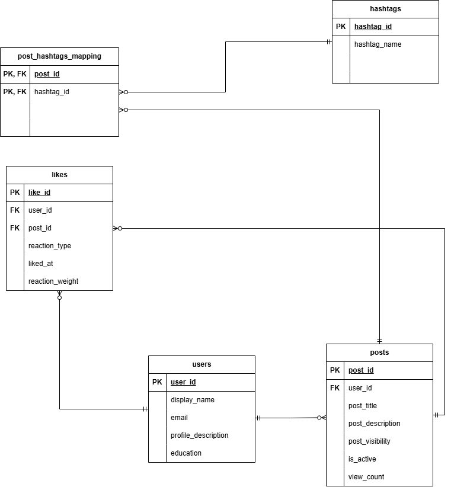

# ex603-social-media-database

**Student:** Debashish Gupta
**Course:** EX603 - Data and Algorithms for Scalable Systems
**Theme:** Social Media

## Project Overview

This project models a relational database for a social media platform where users create posts, interact with posts through likes, and organize content using hashtags.

The database will be developed incrementally across Units 1-6, beginning with conceptual data modeling and progressing through schema creation, SQL querying, joins, aggregations, analytics, and query optimization.

## Domain

This project represents a simple social media platform where users can create posts and react to posts. Posts can be public or visible only to friends, and the platform keeps information such as post activity, view count, and reactions.

Hashtags are used to organize and classify posts. A post can have many hashtags, and the same hashtag can be used by many posts. The `post_hashtags_mapping` table connects posts and hashtags without storing duplicate relationships.

The database should be able to answer questions such as which users created particular posts, which posts received the most reactions, which hashtags are used most often, and which posts have high view counts.

## Entity Relationship Diagram

